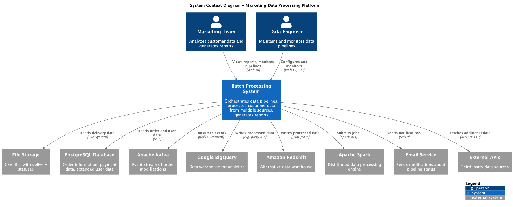
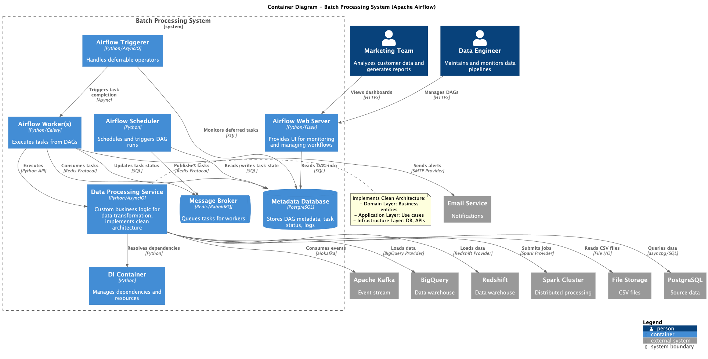
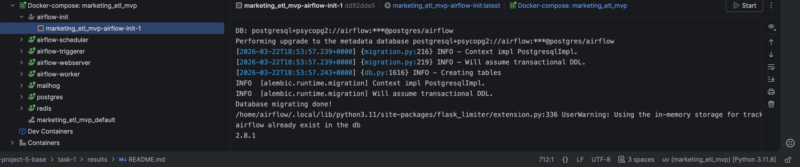
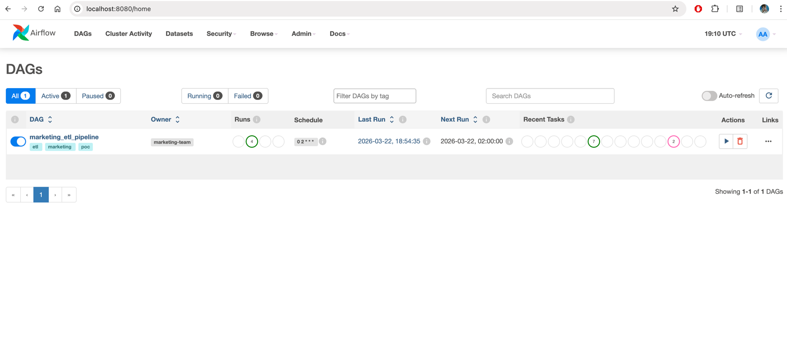
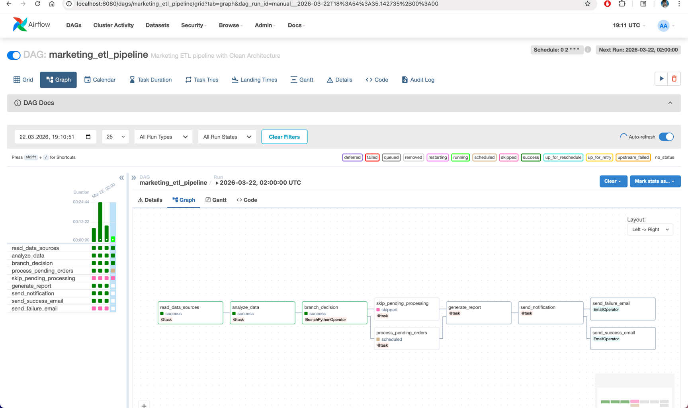
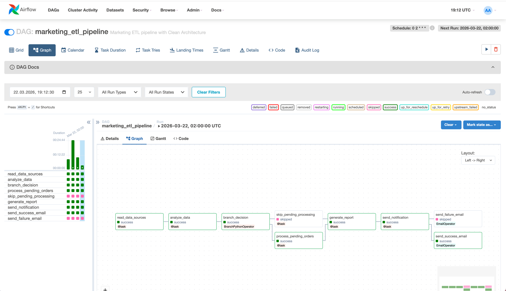
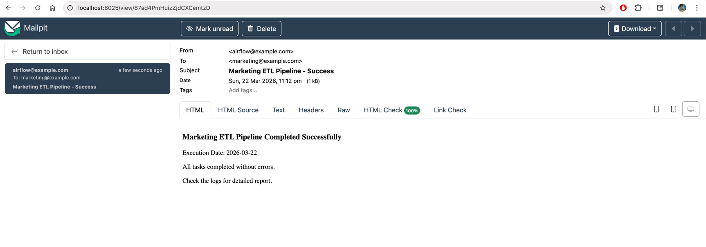

# Решение для пакетной обработки данных маркетингового отдела

## Выбранное технологическое решение: Apache Airflow

### Обоснование выбора

Apache Airflow был выбран в качестве основного решения для оркестрации пакетной обработки данных по следующим причинам:

1. **Масштабируемость**: Способность обрабатывать миллионы записей за один запуск
2. **Гибкость**: Python-based решение с возможностью написания кастомной логики
3. **Богатая экосистема**: Обширная библиотека готовых интеграций (providers)
4. **Мониторинг и наблюдаемость**: Встроенный веб-интерфейс с визуализацией DAG
5. **Активное сообщество**: Проект Apache Foundation с большой базой пользователей
6. **Cloud-native**: Нативная поддержка облачных провайдеров

## 1. Интеграция с внешними системами

### BigQuery

**Готовые модули**: `apache-airflow-providers-google`

Возможности:

- `BigQueryInsertJobOperator` - выполнение SQL запросов
- `BigQueryCreateEmptyTableOperator` - создание таблиц
- `BigQueryToGCSOperator` - экспорт данных
- `GCSToBigQueryOperator` - загрузка данных из GCS
- `BigQueryHook` - низкоуровневый API для кастомных операций

Пример использования:

```python
from airflow.providers.google.cloud.operators.bigquery import BigQueryInsertJobOperator

load_to_bq = BigQueryInsertJobOperator(
    task_id='load_to_bigquery',
    configuration={
        "query": {
            "query": "INSERT INTO dataset.table ...",
            "useLegacySql": False,
        }
    }
)
```

### Amazon Redshift

**Готовые модули**: `apache-airflow-providers-amazon`

Возможности:

- `RedshiftDataOperator` - выполнение SQL команд
- `RedshiftSQLOperator` - SQL операции
- `S3ToRedshiftOperator` - загрузка из S3
- `RedshiftToS3Operator` - выгрузка в S3
- `RedshiftClusterSensor` - мониторинг состояния кластера

Пример использования:

```python
from airflow.providers.amazon.aws.operators.redshift_data import RedshiftDataOperator

execute_query = RedshiftDataOperator(
    task_id='load_to_redshift',
    cluster_identifier='my-cluster',
    database='dev',
    sql='COPY table FROM s3://bucket/data'
)
```

### Apache Kafka

**Готовые модули**: `apache-airflow-providers-apache-kafka`

Возможности:

- `ConsumeFromTopicOperator` - чтение сообщений
- `ProduceToTopicOperator` - публикация сообщений
- Поддержка Avro, JSON схем
- Интеграция с Schema Registry

Дополнительно можно использовать:

- `aiokafka` для асинхронного чтения в кастомных операторах
- `confluent-kafka-python` для расширенных возможностей

Пример использования:

```python
from airflow.providers.apache.kafka.operators.consume import ConsumeFromTopicOperator

consume_events = ConsumeFromTopicOperator(
    task_id='consume_order_events',
    topics=['order.modifications'],
    apply_function='process_kafka_messages',
    kafka_config_id='kafka_default'
)
```

### Apache Spark

**Готовые модули**: `apache-airflow-providers-apache-spark`

Возможности:

- `SparkSubmitOperator` - отправка Spark jobs
- `SparkJDBCOperator` - JDBC операции через Spark
- `SparkSQLOperator` - выполнение Spark SQL
- Поддержка различных cluster managers (YARN, Kubernetes, Standalone)

Пример использования:

```python
from airflow.providers.apache.spark.operators.spark_submit import SparkSubmitOperator

spark_job = SparkSubmitOperator(
    task_id='process_large_dataset',
    application='/path/to/spark_job.py',
    conf={
        'spark.executor.memory': '4g',
        'spark.executor.cores': '2'
    }
)
```

**Вывод**: Для всех требуемых систем интеграции существуют официальные provider-пакеты, которые значительно ускоряют
разработку и обеспечивают надёжность.

## 2. Ветвление, условные операторы и event-triggers

### Ветвление (Branching)

Airflow поддерживает несколько типов ветвления:

**BranchPythonOperator**:

```python
from airflow.operators.python import BranchPythonOperator


def choose_branch(**context):
    if context['ti'].xcom_pull(task_ids='analyze_data') > 1000000:
        return 'process_large_dataset'
    else:
        return 'process_small_dataset'


branch_task = BranchPythonOperator(
    task_id='branch_decision',
    python_callable=choose_branch
)
```

**ShortCircuitOperator**:

```python
from airflow.operators.python import ShortCircuitOperator

check_condition = ShortCircuitOperator(
    task_id='check_data_exists',
    python_callable=lambda: data_exists()
)
```

**BranchSQLOperator**:

```python
from airflow.operators.sql import BranchSQLOperator

branch_sql = BranchSQLOperator(
    task_id='branch_on_count',
    sql="SELECT COUNT(*) FROM orders WHERE status='pending'",
    follow_task_ids_if_true='process_pending',
    follow_task_ids_if_false='skip_processing'
)
```

### Условные операторы

**Trigger Rules**:

- `all_success` (default) - все родительские задачи успешны
- `all_failed` - все родительские задачи провалились
- `all_done` - все родительские задачи завершены
- `one_success` - хотя бы одна задача успешна
- `one_failed` - хотя бы одна задача провалилась
- `none_failed` - ни одна задача не провалилась
- `none_skipped` - ни одна задача не пропущена

```python
cleanup_task = BashOperator(
    task_id='cleanup',
    bash_command='rm -rf /tmp/data',
    trigger_rule='all_done'  # выполняется всегда
)
```

### Event-triggers

Airflow поддерживает различные типы триггеров:

**Sensors** (ожидание событий):

```python
from airflow.sensors.filesystem import FileSensor
from airflow.providers.amazon.aws.sensors.s3 import S3KeySensor

wait_for_file = FileSensor(
    task_id='wait_for_csv',
    filepath='/data/deliveries.csv',
    poke_interval=60
)

wait_for_s3 = S3KeySensor(
    task_id='wait_for_s3_file',
    bucket_name='my-bucket',
    bucket_key='data/{{ds}}/file.csv'
)
```

**Deferrable Operators** (асинхронное ожидание):

```python
from airflow.sensors.base import PokeReturnValue
from airflow.triggers.temporal import TimeDeltaTrigger


class CustomDeferrableSensor(BaseSensorOperator):
    def execute(self, context):
        if not self.poke(context):
            self.defer(
                trigger=TimeDeltaTrigger(timedelta(minutes=5)),
                method_name="execute_complete"
            )
```

**Dataset-driven Scheduling** (с Airflow 2.4+):

```python
from airflow import Dataset

dataset_orders = Dataset("postgres://orders_table")

# DAG который обновляет dataset
with DAG(...) as producer:
    update_orders = PostgresOperator(
        task_id='update',
        outlets=[dataset_orders]
    )

# DAG который запускается при обновлении dataset
with DAG(schedule=[dataset_orders]) as consumer:
    process_orders = PythonOperator(...)
```

**Вывод**: Airflow предоставляет богатый набор инструментов для ветвления, условной логики и event-driven оркестрации.

## 3. Fallback-logic, Retry и Email-уведомления

### Retry (Повторные попытки)

Встроенная поддержка на уровне задач:

```python
from datetime import timedelta

default_args = {
    'retries': 3,  # количество попыток
    'retry_delay': timedelta(minutes=5),  # задержка между попытками
    'retry_exponential_backoff': True,  # экспоненциальная задержка
    'max_retry_delay': timedelta(hours=1),  # максимальная задержка
}

task = PythonOperator(
    task_id='flaky_task',
    python_callable=process_data,
    retries=5,
    retry_delay=timedelta(minutes=2)
)
```

### Fallback-logic

Реализуется через комбинацию `trigger_rule` и структуры DAG:

```python
primary_task = PythonOperator(
    task_id='primary_processing',
    python_callable=primary_method
)

fallback_task = PythonOperator(
    task_id='fallback_processing',
    python_callable=fallback_method,
    trigger_rule='one_failed'  # запускается если primary провалился
)

success_task = PythonOperator(
    task_id='finalize',
    python_callable=finalize,
    trigger_rule='one_success'  # запускается если хоть что-то успешно
)

primary_task >> [fallback_task, success_task]
fallback_task >> success_task
```

Альтернативный подход с `on_failure_callback`:

```python
def fallback_handler(context):
    # Логика fallback
    logger.info("Primary task failed, executing fallback")
    execute_fallback_logic()


task = PythonOperator(
    task_id='task_with_fallback',
    python_callable=main_logic,
    on_failure_callback=fallback_handler
)
```

### Email-уведомления

**Из коробки поддерживаются**:

Глобальные настройки (в `airflow.cfg`):

```ini
[smtp]
smtp_host = smtp.gmail.com
smtp_starttls = True
smtp_ssl = False
smtp_user = your-email@gmail.com
smtp_password = your-password
smtp_port = 587
smtp_mail_from = airflow@example.com
```

На уровне DAG:

```python
default_args = {
    'email': ['team@company.com'],
    'email_on_failure': True,
    'email_on_retry': False,
    'email_on_success': True,
}
```

Использование `EmailOperator`:

```python
from airflow.operators.email import EmailOperator

send_email = EmailOperator(
    task_id='send_report',
    to='marketing@company.com',
    subject='Daily Report {{ ds }}',
    html_content='<h3>Report for {{ ds }}</h3><p>{{ ti.xcom_pull(task_ids="generate_stats") }}</p>'
)
```

Кастомные уведомления с callback:

```python
def success_callback(context):
    from airflow.utils.email import send_email

    send_email(
        to='manager@company.com',
        subject=f'Success: {context["task"].task_id}',
        html_content=f'Task completed at {context["ts"]}'
    )


task = PythonOperator(
    task_id='important_task',
    python_callable=process,
    on_success_callback=success_callback
)
```

**Интеграция со сторонними сервисами**:

- Slack: `SlackWebhookOperator`, `SlackAPIPostOperator`
- Microsoft Teams: `MSTeamsWebhookOperator`
- PagerDuty: `PagerdutyEventsOperator`
- Telegram: кастомные операторы через API

**Вывод**: Airflow предоставляет комплексные возможности для retry-логики, fallback-сценариев и уведомлений из коробки,
с гибкими настройками на уровне задач и DAG.

## 4. Развёртывание в облачной среде

Поддерживается: Airflow имеет отличную поддержку облачных платформ с готовыми managed-сервисами (Cloud Composer, MWAA)
или возможностью развёртывания на Kubernetes для полного контроля. Миграция из локального окружения в облако
осуществляется
без изменения кода DAG.

## Архитектура решения

### C4 Диаграммы

Архитектура решения представлена в виде C4 диаграмм:



1. **Level 1 - System Context**: `diagrams/puml/c4-level1-system-context.puml`
    - Показывает взаимодействие системы пакетной обработки с внешними системами
    - Отображает пользователей (Marketing Team, Data Engineer)
    - Внешние системы: PostgreSQL, Kafka, File Storage, BigQuery, Redshift, Spark



2. **Level 2 - Container**: `diagrams/puml/c4-level2-container.puml`
    - Детализация компонентов Airflow
    - Веб-сервер, Scheduler, Workers, Triggerer
    - Metadata DB, Message Broker
    - Кастомный Data Processing Service с Clean Architecture

Для визуализации диаграмм используйте PlantUML:

```bash
# Установка PlantUML
brew install plantuml  # macOS
# или
sudo apt-get install plantuml  # Linux

# Генерация изображений
plantuml diagrams/puml/*.puml -o ../img/
```

Или онлайн: http://www.plantuml.com/plantuml/uml/

## Proof of Work

1. Собираем и запускаем контейнеры
   
2. Заходим в Airflow
   
3. Видим корректно собранный DAG
   
4. Ждем пока выполниться до конца
   
5. На почту придет доп уведомление
   
6. Логи из контейнеров:

```shell
airflow-triggerer-1  | [2026-03-22T19:14:08.911+0000] {triggerer_job_runner.py:481} INFO - 0 triggers currently running
airflow-scheduler-1  | [2026-03-22T19:14:09.008+0000] {scheduler_job_runner.py:1619} INFO - Adopting or resetting orphaned tasks for active dag runs
airflow-scheduler-1  | 127.0.0.1 - - [22/Mar/2026 19:14:12] "GET /health HTTP/1.1" 200 -
airflow-webserver-1  | 192.168.65.1 - - [22/Mar/2026:19:14:13 +0000] "POST /dagrun_clear HTTP/1.1" 200 34 "http://localhost:8080/dags/marketing_etl_pipeline/grid?tab=graph&dag_run_id=manual__2026-03-22T18%3A54%3A35.142735%2B00%3A00" "Mozilla/5.0 (Macintosh; Intel Mac OS X 10_15_7) AppleWebKit/537.36 (KHTML, like Gecko) Chrome/146.0.0.0 Safari/537.36"
airflow-webserver-1  | 192.168.65.1 - - [22/Mar/2026:19:14:13 +0000] "GET /object/grid_data?dag_id=marketing_etl_pipeline&num_runs=25 HTTP/1.1" 200 13229 "http://localhost:8080/dags/marketing_etl_pipeline/grid?tab=graph&dag_run_id=manual__2026-03-22T18%3A54%3A35.142735%2B00%3A00" "Mozilla/5.0 (Macintosh; Intel Mac OS X 10_15_7) AppleWebKit/537.36 (KHTML, like Gecko) Chrome/146.0.0.0 Safari/537.36"
airflow-scheduler-1  | [2026-03-22T19:14:14.567+0000] {scheduler_job_runner.py:424} INFO - 1 tasks up for execution:
airflow-scheduler-1  | 	<TaskInstance: marketing_etl_pipeline.read_data_sources manual__2026-03-22T18:54:35.142735+00:00 [scheduled]>
airflow-scheduler-1  | [2026-03-22T19:14:14.567+0000] {scheduler_job_runner.py:487} INFO - DAG marketing_etl_pipeline has 0/16 running and queued tasks
airflow-scheduler-1  | [2026-03-22T19:14:14.567+0000] {scheduler_job_runner.py:603} INFO - Setting the following tasks to queued state:
airflow-scheduler-1  | 	<TaskInstance: marketing_etl_pipeline.read_data_sources manual__2026-03-22T18:54:35.142735+00:00 [scheduled]>
airflow-scheduler-1  | [2026-03-22T19:14:14.569+0000] {scheduler_job_runner.py:646} INFO - Sending TaskInstanceKey(dag_id='marketing_etl_pipeline', task_id='read_data_sources', run_id='manual__2026-03-22T18:54:35.142735+00:00', try_number=4, map_index=-1) to executor with priority 9 and queue default
airflow-scheduler-1  | [2026-03-22T19:14:14.569+0000] {base_executor.py:146} INFO - Adding to queue: ['airflow', 'tasks', 'run', 'marketing_etl_pipeline', 'read_data_sources', 'manual__2026-03-22T18:54:35.142735+00:00', '--local', '--subdir', 'DAGS_FOLDER/marketing_etl_dag.py']
airflow-worker-1     | [2026-03-22 19:14:14,573: INFO/MainProcess] Task airflow.providers.celery.executors.celery_executor_utils.execute_command[707a8e35-6dbc-411f-a726-dae3e610e142] received
airflow-worker-1     | [2026-03-22 19:14:14,577: INFO/ForkPoolWorker-15] [707a8e35-6dbc-411f-a726-dae3e610e142] Executing command in Celery: ['airflow', 'tasks', 'run', 'marketing_etl_pipeline', 'read_data_sources', 'manual__2026-03-22T18:54:35.142735+00:00', '--local', '--subdir', 'DAGS_FOLDER/marketing_etl_dag.py']
airflow-scheduler-1  | [2026-03-22T19:14:14.589+0000] {scheduler_job_runner.py:696} INFO - Received executor event with state queued for task instance TaskInstanceKey(dag_id='marketing_etl_pipeline', task_id='read_data_sources', run_id='manual__2026-03-22T18:54:35.142735+00:00', try_number=4, map_index=-1)
airflow-scheduler-1  | [2026-03-22T19:14:14.592+0000] {scheduler_job_runner.py:723} INFO - Setting external_id for <TaskInstance: marketing_etl_pipeline.read_data_sources manual__2026-03-22T18:54:35.142735+00:00 [queued]> to 707a8e35-6dbc-411f-a726-dae3e610e142
airflow-worker-1     | [2026-03-22 19:14:14,621: INFO/ForkPoolWorker-15] Filling up the DagBag from /opt/airflow/dags/marketing_etl_dag.py
airflow-worker-1     | [2026-03-22 19:14:14,701: INFO/ForkPoolWorker-15] Running <TaskInstance: marketing_etl_pipeline.read_data_sources manual__2026-03-22T18:54:35.142735+00:00 [queued]> on host ccad9189b40d
airflow-worker-1     | [2026-03-22 19:14:14,968: INFO/ForkPoolWorker-15] Task airflow.providers.celery.executors.celery_executor_utils.execute_command[707a8e35-6dbc-411f-a726-dae3e610e142] succeeded in 0.39488941700074065s: None
airflow-scheduler-1  | [2026-03-22T19:14:15.658+0000] {scheduler_job_runner.py:424} INFO - 1 tasks up for execution:
airflow-scheduler-1  | 	<TaskInstance: marketing_etl_pipeline.analyze_data manual__2026-03-22T18:54:35.142735+00:00 [scheduled]>
airflow-scheduler-1  | [2026-03-22T19:14:15.658+0000] {scheduler_job_runner.py:487} INFO - DAG marketing_etl_pipeline has 0/16 running and queued tasks
airflow-scheduler-1  | [2026-03-22T19:14:15.658+0000] {scheduler_job_runner.py:603} INFO - Setting the following tasks to queued state:
airflow-scheduler-1  | 	<TaskInstance: marketing_etl_pipeline.analyze_data manual__2026-03-22T18:54:35.142735+00:00 [scheduled]>
airflow-scheduler-1  | [2026-03-22T19:14:15.659+0000] {scheduler_job_runner.py:646} INFO - Sending TaskInstanceKey(dag_id='marketing_etl_pipeline', task_id='analyze_data', run_id='manual__2026-03-22T18:54:35.142735+00:00', try_number=4, map_index=-1) to executor with priority 8 and queue default
airflow-scheduler-1  | [2026-03-22T19:14:15.659+0000] {base_executor.py:146} INFO - Adding to queue: ['airflow', 'tasks', 'run', 'marketing_etl_pipeline', 'analyze_data', 'manual__2026-03-22T18:54:35.142735+00:00', '--local', '--subdir', 'DAGS_FOLDER/marketing_etl_dag.py']
airflow-worker-1     | [2026-03-22 19:14:15,661: INFO/MainProcess] Task airflow.providers.celery.executors.celery_executor_utils.execute_command[917aa88e-4c94-42d4-8f63-017b2eff01b4] received
airflow-worker-1     | [2026-03-22 19:14:15,664: INFO/ForkPoolWorker-15] [917aa88e-4c94-42d4-8f63-017b2eff01b4] Executing command in Celery: ['airflow', 'tasks', 'run', 'marketing_etl_pipeline', 'analyze_data', 'manual__2026-03-22T18:54:35.142735+00:00', '--local', '--subdir', 'DAGS_FOLDER/marketing_etl_dag.py']
airflow-scheduler-1  | [2026-03-22T19:14:15.678+0000] {scheduler_job_runner.py:696} INFO - Received executor event with state queued for task instance TaskInstanceKey(dag_id='marketing_etl_pipeline', task_id='analyze_data', run_id='manual__2026-03-22T18:54:35.142735+00:00', try_number=4, map_index=-1)
airflow-scheduler-1  | [2026-03-22T19:14:15.678+0000] {scheduler_job_runner.py:696} INFO - Received executor event with state success for task instance TaskInstanceKey(dag_id='marketing_etl_pipeline', task_id='read_data_sources', run_id='manual__2026-03-22T18:54:35.142735+00:00', try_number=4, map_index=-1)
airflow-scheduler-1  | [2026-03-22T19:14:15.681+0000] {scheduler_job_runner.py:733} INFO - TaskInstance Finished: dag_id=marketing_etl_pipeline, task_id=read_data_sources, run_id=manual__2026-03-22T18:54:35.142735+00:00, map_index=-1, run_start_date=2026-03-22 19:14:14.741669+00:00, run_end_date=2026-03-22 19:14:14.906317+00:00, run_duration=0.164648, state=success, executor_state=success, try_number=4, max_tries=6, job_id=83, pool=default_pool, queue=default, priority_weight=9, operator=_PythonDecoratedOperator, queued_dttm=2026-03-22 19:14:14.568312+00:00, queued_by_job_id=58, pid=379
airflow-scheduler-1  | [2026-03-22T19:14:15.681+0000] {scheduler_job_runner.py:723} INFO - Setting external_id for <TaskInstance: marketing_etl_pipeline.analyze_data manual__2026-03-22T18:54:35.142735+00:00 [queued]> to 917aa88e-4c94-42d4-8f63-017b2eff01b4
airflow-worker-1     | [2026-03-22 19:14:15,709: INFO/ForkPoolWorker-15] Filling up the DagBag from /opt/airflow/dags/marketing_etl_dag.py
airflow-worker-1     | [2026-03-22 19:14:15,796: INFO/ForkPoolWorker-15] Running <TaskInstance: marketing_etl_pipeline.analyze_data manual__2026-03-22T18:54:35.142735+00:00 [queued]> on host ccad9189b40d
airflow-worker-1     | [2026-03-22 19:14:16,082: INFO/ForkPoolWorker-15] Task airflow.providers.celery.executors.celery_executor_utils.execute_command[917aa88e-4c94-42d4-8f63-017b2eff01b4] succeeded in 0.42062300100042194s: None
airflow-scheduler-1  | [2026-03-22T19:14:16.752+0000] {scheduler_job_runner.py:424} INFO - 1 tasks up for execution:
airflow-scheduler-1  | 	<TaskInstance: marketing_etl_pipeline.branch_decision manual__2026-03-22T18:54:35.142735+00:00 [scheduled]>
airflow-scheduler-1  | [2026-03-22T19:14:16.753+0000] {scheduler_job_runner.py:487} INFO - DAG marketing_etl_pipeline has 0/16 running and queued tasks
airflow-scheduler-1  | [2026-03-22T19:14:16.753+0000] {scheduler_job_runner.py:603} INFO - Setting the following tasks to queued state:
airflow-scheduler-1  | 	<TaskInstance: marketing_etl_pipeline.branch_decision manual__2026-03-22T18:54:35.142735+00:00 [scheduled]>
airflow-scheduler-1  | [2026-03-22T19:14:16.754+0000] {scheduler_job_runner.py:646} INFO - Sending TaskInstanceKey(dag_id='marketing_etl_pipeline', task_id='branch_decision', run_id='manual__2026-03-22T18:54:35.142735+00:00', try_number=4, map_index=-1) to executor with priority 7 and queue default
airflow-scheduler-1  | [2026-03-22T19:14:16.754+0000] {base_executor.py:146} INFO - Adding to queue: ['airflow', 'tasks', 'run', 'marketing_etl_pipeline', 'branch_decision', 'manual__2026-03-22T18:54:35.142735+00:00', '--local', '--subdir', 'DAGS_FOLDER/marketing_etl_dag.py']
airflow-worker-1     | [2026-03-22 19:14:16,756: INFO/MainProcess] Task airflow.providers.celery.executors.celery_executor_utils.execute_command[be4e6774-36c4-46b7-a5fa-3da0c7e398d7] received
airflow-worker-1     | [2026-03-22 19:14:16,759: INFO/ForkPoolWorker-15] [be4e6774-36c4-46b7-a5fa-3da0c7e398d7] Executing command in Celery: ['airflow', 'tasks', 'run', 'marketing_etl_pipeline', 'branch_decision', 'manual__2026-03-22T18:54:35.142735+00:00', '--local', '--subdir', 'DAGS_FOLDER/marketing_etl_dag.py']
airflow-scheduler-1  | [2026-03-22T19:14:16.772+0000] {scheduler_job_runner.py:696} INFO - Received executor event with state queued for task instance TaskInstanceKey(dag_id='marketing_etl_pipeline', task_id='branch_decision', run_id='manual__2026-03-22T18:54:35.142735+00:00', try_number=4, map_index=-1)
airflow-scheduler-1  | [2026-03-22T19:14:16.772+0000] {scheduler_job_runner.py:696} INFO - Received executor event with state success for task instance TaskInstanceKey(dag_id='marketing_etl_pipeline', task_id='analyze_data', run_id='manual__2026-03-22T18:54:35.142735+00:00', try_number=4, map_index=-1)
airflow-scheduler-1  | [2026-03-22T19:14:16.774+0000] {scheduler_job_runner.py:733} INFO - TaskInstance Finished: dag_id=marketing_etl_pipeline, task_id=analyze_data, run_id=manual__2026-03-22T18:54:35.142735+00:00, map_index=-1, run_start_date=2026-03-22 19:14:15.835928+00:00, run_end_date=2026-03-22 19:14:16.008627+00:00, run_duration=0.172699, state=success, executor_state=success, try_number=4, max_tries=5, job_id=84, pool=default_pool, queue=default, priority_weight=8, operator=_PythonDecoratedOperator, queued_dttm=2026-03-22 19:14:15.659111+00:00, queued_by_job_id=58, pid=381
airflow-scheduler-1  | [2026-03-22T19:14:16.775+0000] {scheduler_job_runner.py:723} INFO - Setting external_id for <TaskInstance: marketing_etl_pipeline.branch_decision manual__2026-03-22T18:54:35.142735+00:00 [queued]> to be4e6774-36c4-46b7-a5fa-3da0c7e398d7
airflow-worker-1     | [2026-03-22 19:14:16,804: INFO/ForkPoolWorker-15] Filling up the DagBag from /opt/airflow/dags/marketing_etl_dag.py
airflow-worker-1     | [2026-03-22 19:14:16,884: INFO/ForkPoolWorker-15] Running <TaskInstance: marketing_etl_pipeline.branch_decision manual__2026-03-22T18:54:35.142735+00:00 [queued]> on host ccad9189b40d
airflow-worker-1     | [2026-03-22 19:14:17,112: INFO/ForkPoolWorker-15] Task airflow.providers.celery.executors.celery_executor_utils.execute_command[be4e6774-36c4-46b7-a5fa-3da0c7e398d7] succeeded in 0.35475445900010527s: None
airflow-scheduler-1  | [2026-03-22T19:14:17.845+0000] {scheduler_job_runner.py:424} INFO - 1 tasks up for execution:
airflow-scheduler-1  | 	<TaskInstance: marketing_etl_pipeline.process_pending_orders manual__2026-03-22T18:54:35.142735+00:00 [scheduled]>
airflow-scheduler-1  | [2026-03-22T19:14:17.846+0000] {scheduler_job_runner.py:487} INFO - DAG marketing_etl_pipeline has 0/16 running and queued tasks
airflow-scheduler-1  | [2026-03-22T19:14:17.846+0000] {scheduler_job_runner.py:603} INFO - Setting the following tasks to queued state:
airflow-scheduler-1  | 	<TaskInstance: marketing_etl_pipeline.process_pending_orders manual__2026-03-22T18:54:35.142735+00:00 [scheduled]>
airflow-scheduler-1  | [2026-03-22T19:14:17.847+0000] {scheduler_job_runner.py:646} INFO - Sending TaskInstanceKey(dag_id='marketing_etl_pipeline', task_id='process_pending_orders', run_id='manual__2026-03-22T18:54:35.142735+00:00', try_number=4, map_index=-1) to executor with priority 5 and queue default
airflow-scheduler-1  | [2026-03-22T19:14:17.847+0000] {base_executor.py:146} INFO - Adding to queue: ['airflow', 'tasks', 'run', 'marketing_etl_pipeline', 'process_pending_orders', 'manual__2026-03-22T18:54:35.142735+00:00', '--local', '--subdir', 'DAGS_FOLDER/marketing_etl_dag.py']
airflow-worker-1     | [2026-03-22 19:14:17,849: INFO/MainProcess] Task airflow.providers.celery.executors.celery_executor_utils.execute_command[810ce69c-6b7e-460e-92b7-c28ed2009b76] received
airflow-worker-1     | [2026-03-22 19:14:17,852: INFO/ForkPoolWorker-15] [810ce69c-6b7e-460e-92b7-c28ed2009b76] Executing command in Celery: ['airflow', 'tasks', 'run', 'marketing_etl_pipeline', 'process_pending_orders', 'manual__2026-03-22T18:54:35.142735+00:00', '--local', '--subdir', 'DAGS_FOLDER/marketing_etl_dag.py']
airflow-scheduler-1  | [2026-03-22T19:14:17.865+0000] {scheduler_job_runner.py:696} INFO - Received executor event with state queued for task instance TaskInstanceKey(dag_id='marketing_etl_pipeline', task_id='process_pending_orders', run_id='manual__2026-03-22T18:54:35.142735+00:00', try_number=4, map_index=-1)
airflow-scheduler-1  | [2026-03-22T19:14:17.865+0000] {scheduler_job_runner.py:696} INFO - Received executor event with state success for task instance TaskInstanceKey(dag_id='marketing_etl_pipeline', task_id='branch_decision', run_id='manual__2026-03-22T18:54:35.142735+00:00', try_number=4, map_index=-1)
airflow-scheduler-1  | [2026-03-22T19:14:17.868+0000] {scheduler_job_runner.py:733} INFO - TaskInstance Finished: dag_id=marketing_etl_pipeline, task_id=branch_decision, run_id=manual__2026-03-22T18:54:35.142735+00:00, map_index=-1, run_start_date=2026-03-22 19:14:16.926206+00:00, run_end_date=2026-03-22 19:14:17.050655+00:00, run_duration=0.124449, state=success, executor_state=success, try_number=4, max_tries=6, job_id=85, pool=default_pool, queue=default, priority_weight=7, operator=BranchPythonOperator, queued_dttm=2026-03-22 19:14:16.753636+00:00, queued_by_job_id=58, pid=383
airflow-scheduler-1  | [2026-03-22T19:14:17.868+0000] {scheduler_job_runner.py:723} INFO - Setting external_id for <TaskInstance: marketing_etl_pipeline.process_pending_orders manual__2026-03-22T18:54:35.142735+00:00 [queued]> to 810ce69c-6b7e-460e-92b7-c28ed2009b76
airflow-worker-1     | [2026-03-22 19:14:17,894: INFO/ForkPoolWorker-15] Filling up the DagBag from /opt/airflow/dags/marketing_etl_dag.py
airflow-webserver-1  | 127.0.0.1 - - [22/Mar/2026:19:14:17 +0000] "GET /health HTTP/1.1" 200 318 "-" "curl/7.88.1"
airflow-worker-1     | [2026-03-22 19:14:17,969: INFO/ForkPoolWorker-15] Running <TaskInstance: marketing_etl_pipeline.process_pending_orders manual__2026-03-22T18:54:35.142735+00:00 [queued]> on host ccad9189b40d
airflow-worker-1     | [2026-03-22 19:14:18,226: INFO/ForkPoolWorker-15] Task airflow.providers.celery.executors.celery_executor_utils.execute_command[810ce69c-6b7e-460e-92b7-c28ed2009b76] succeeded in 0.3762776670009771s: None
airflow-scheduler-1  | [2026-03-22T19:14:19.193+0000] {scheduler_job_runner.py:424} INFO - 1 tasks up for execution:
airflow-scheduler-1  | 	<TaskInstance: marketing_etl_pipeline.generate_report manual__2026-03-22T18:54:35.142735+00:00 [scheduled]>
airflow-scheduler-1  | [2026-03-22T19:14:19.194+0000] {scheduler_job_runner.py:487} INFO - DAG marketing_etl_pipeline has 0/16 running and queued tasks
airflow-scheduler-1  | [2026-03-22T19:14:19.194+0000] {scheduler_job_runner.py:603} INFO - Setting the following tasks to queued state:
airflow-scheduler-1  | 	<TaskInstance: marketing_etl_pipeline.generate_report manual__2026-03-22T18:54:35.142735+00:00 [scheduled]>
airflow-scheduler-1  | [2026-03-22T19:14:19.195+0000] {scheduler_job_runner.py:646} INFO - Sending TaskInstanceKey(dag_id='marketing_etl_pipeline', task_id='generate_report', run_id='manual__2026-03-22T18:54:35.142735+00:00', try_number=4, map_index=-1) to executor with priority 4 and queue default
airflow-scheduler-1  | [2026-03-22T19:14:19.195+0000] {base_executor.py:146} INFO - Adding to queue: ['airflow', 'tasks', 'run', 'marketing_etl_pipeline', 'generate_report', 'manual__2026-03-22T18:54:35.142735+00:00', '--local', '--subdir', 'DAGS_FOLDER/marketing_etl_dag.py']
airflow-worker-1     | [2026-03-22 19:14:19,199: INFO/MainProcess] Task airflow.providers.celery.executors.celery_executor_utils.execute_command[fedd6837-f6a2-49f5-8f9a-ac03bfcefaf8] received
airflow-worker-1     | [2026-03-22 19:14:19,204: INFO/ForkPoolWorker-15] [fedd6837-f6a2-49f5-8f9a-ac03bfcefaf8] Executing command in Celery: ['airflow', 'tasks', 'run', 'marketing_etl_pipeline', 'generate_report', 'manual__2026-03-22T18:54:35.142735+00:00', '--local', '--subdir', 'DAGS_FOLDER/marketing_etl_dag.py']
airflow-scheduler-1  | [2026-03-22T19:14:19.216+0000] {scheduler_job_runner.py:696} INFO - Received executor event with state queued for task instance TaskInstanceKey(dag_id='marketing_etl_pipeline', task_id='generate_report', run_id='manual__2026-03-22T18:54:35.142735+00:00', try_number=4, map_index=-1)
airflow-scheduler-1  | [2026-03-22T19:14:19.216+0000] {scheduler_job_runner.py:696} INFO - Received executor event with state success for task instance TaskInstanceKey(dag_id='marketing_etl_pipeline', task_id='process_pending_orders', run_id='manual__2026-03-22T18:54:35.142735+00:00', try_number=4, map_index=-1)
airflow-scheduler-1  | [2026-03-22T19:14:19.218+0000] {scheduler_job_runner.py:723} INFO - Setting external_id for <TaskInstance: marketing_etl_pipeline.generate_report manual__2026-03-22T18:54:35.142735+00:00 [queued]> to fedd6837-f6a2-49f5-8f9a-ac03bfcefaf8
airflow-scheduler-1  | [2026-03-22T19:14:19.218+0000] {scheduler_job_runner.py:733} INFO - TaskInstance Finished: dag_id=marketing_etl_pipeline, task_id=process_pending_orders, run_id=manual__2026-03-22T18:54:35.142735+00:00, map_index=-1, run_start_date=2026-03-22 19:14:18.006716+00:00, run_end_date=2026-03-22 19:14:18.176498+00:00, run_duration=0.169782, state=success, executor_state=success, try_number=4, max_tries=6, job_id=86, pool=default_pool, queue=default, priority_weight=5, operator=_PythonDecoratedOperator, queued_dttm=2026-03-22 19:14:17.846481+00:00, queued_by_job_id=58, pid=385
airflow-worker-1     | [2026-03-22 19:14:19,245: INFO/ForkPoolWorker-15] Filling up the DagBag from /opt/airflow/dags/marketing_etl_dag.py
airflow-worker-1     | [2026-03-22 19:14:19,322: INFO/ForkPoolWorker-15] Running <TaskInstance: marketing_etl_pipeline.generate_report manual__2026-03-22T18:54:35.142735+00:00 [queued]> on host ccad9189b40d
airflow-worker-1     | [2026-03-22 19:14:19,505: INFO/ForkPoolWorker-15] Task airflow.providers.celery.executors.celery_executor_utils.execute_command[fedd6837-f6a2-49f5-8f9a-ac03bfcefaf8] succeeded in 0.3048827919992618s: None
airflow-scheduler-1  | [2026-03-22T19:14:20.272+0000] {scheduler_job_runner.py:424} INFO - 1 tasks up for execution:
airflow-scheduler-1  | 	<TaskInstance: marketing_etl_pipeline.send_notification manual__2026-03-22T18:54:35.142735+00:00 [scheduled]>
airflow-scheduler-1  | [2026-03-22T19:14:20.272+0000] {scheduler_job_runner.py:487} INFO - DAG marketing_etl_pipeline has 0/16 running and queued tasks
airflow-scheduler-1  | [2026-03-22T19:14:20.272+0000] {scheduler_job_runner.py:603} INFO - Setting the following tasks to queued state:
airflow-scheduler-1  | 	<TaskInstance: marketing_etl_pipeline.send_notification manual__2026-03-22T18:54:35.142735+00:00 [scheduled]>
airflow-scheduler-1  | [2026-03-22T19:14:20.273+0000] {scheduler_job_runner.py:646} INFO - Sending TaskInstanceKey(dag_id='marketing_etl_pipeline', task_id='send_notification', run_id='manual__2026-03-22T18:54:35.142735+00:00', try_number=4, map_index=-1) to executor with priority 3 and queue default
airflow-scheduler-1  | [2026-03-22T19:14:20.273+0000] {base_executor.py:146} INFO - Adding to queue: ['airflow', 'tasks', 'run', 'marketing_etl_pipeline', 'send_notification', 'manual__2026-03-22T18:54:35.142735+00:00', '--local', '--subdir', 'DAGS_FOLDER/marketing_etl_dag.py']
airflow-worker-1     | [2026-03-22 19:14:20,274: INFO/MainProcess] Task airflow.providers.celery.executors.celery_executor_utils.execute_command[0723c92d-3df1-4ced-8387-134954d77ae1] received
airflow-worker-1     | [2026-03-22 19:14:20,277: INFO/ForkPoolWorker-15] [0723c92d-3df1-4ced-8387-134954d77ae1] Executing command in Celery: ['airflow', 'tasks', 'run', 'marketing_etl_pipeline', 'send_notification', 'manual__2026-03-22T18:54:35.142735+00:00', '--local', '--subdir', 'DAGS_FOLDER/marketing_etl_dag.py']
airflow-scheduler-1  | [2026-03-22T19:14:20.287+0000] {scheduler_job_runner.py:696} INFO - Received executor event with state queued for task instance TaskInstanceKey(dag_id='marketing_etl_pipeline', task_id='send_notification', run_id='manual__2026-03-22T18:54:35.142735+00:00', try_number=4, map_index=-1)
airflow-scheduler-1  | [2026-03-22T19:14:20.287+0000] {scheduler_job_runner.py:696} INFO - Received executor event with state success for task instance TaskInstanceKey(dag_id='marketing_etl_pipeline', task_id='generate_report', run_id='manual__2026-03-22T18:54:35.142735+00:00', try_number=4, map_index=-1)
airflow-scheduler-1  | [2026-03-22T19:14:20.289+0000] {scheduler_job_runner.py:733} INFO - TaskInstance Finished: dag_id=marketing_etl_pipeline, task_id=generate_report, run_id=manual__2026-03-22T18:54:35.142735+00:00, map_index=-1, run_start_date=2026-03-22 19:14:19.359563+00:00, run_end_date=2026-03-22 19:14:19.461944+00:00, run_duration=0.102381, state=success, executor_state=success, try_number=4, max_tries=6, job_id=87, pool=default_pool, queue=default, priority_weight=4, operator=_PythonDecoratedOperator, queued_dttm=2026-03-22 19:14:19.194519+00:00, queued_by_job_id=58, pid=387
airflow-scheduler-1  | [2026-03-22T19:14:20.289+0000] {scheduler_job_runner.py:723} INFO - Setting external_id for <TaskInstance: marketing_etl_pipeline.send_notification manual__2026-03-22T18:54:35.142735+00:00 [queued]> to 0723c92d-3df1-4ced-8387-134954d77ae1
airflow-worker-1     | [2026-03-22 19:14:20,313: INFO/ForkPoolWorker-15] Filling up the DagBag from /opt/airflow/dags/marketing_etl_dag.py
airflow-worker-1     | [2026-03-22 19:14:20,393: INFO/ForkPoolWorker-15] Running <TaskInstance: marketing_etl_pipeline.send_notification manual__2026-03-22T18:54:35.142735+00:00 [queued]> on host ccad9189b40d
airflow-worker-1     | [2026-03-22 19:14:20,666: INFO/ForkPoolWorker-15] Task airflow.providers.celery.executors.celery_executor_utils.execute_command[0723c92d-3df1-4ced-8387-134954d77ae1] succeeded in 0.3916133750008157s: None
airflow-scheduler-1  | [2026-03-22T19:14:21.364+0000] {scheduler_job_runner.py:424} INFO - 1 tasks up for execution:
airflow-scheduler-1  | 	<TaskInstance: marketing_etl_pipeline.send_success_email manual__2026-03-22T18:54:35.142735+00:00 [scheduled]>
airflow-scheduler-1  | [2026-03-22T19:14:21.364+0000] {scheduler_job_runner.py:487} INFO - DAG marketing_etl_pipeline has 0/16 running and queued tasks
airflow-scheduler-1  | [2026-03-22T19:14:21.364+0000] {scheduler_job_runner.py:603} INFO - Setting the following tasks to queued state:
airflow-scheduler-1  | 	<TaskInstance: marketing_etl_pipeline.send_success_email manual__2026-03-22T18:54:35.142735+00:00 [scheduled]>
airflow-scheduler-1  | [2026-03-22T19:14:21.366+0000] {scheduler_job_runner.py:646} INFO - Sending TaskInstanceKey(dag_id='marketing_etl_pipeline', task_id='send_success_email', run_id='manual__2026-03-22T18:54:35.142735+00:00', try_number=4, map_index=-1) to executor with priority 1 and queue default
airflow-scheduler-1  | [2026-03-22T19:14:21.366+0000] {base_executor.py:146} INFO - Adding to queue: ['airflow', 'tasks', 'run', 'marketing_etl_pipeline', 'send_success_email', 'manual__2026-03-22T18:54:35.142735+00:00', '--local', '--subdir', 'DAGS_FOLDER/marketing_etl_dag.py']
airflow-worker-1     | [2026-03-22 19:14:21,368: INFO/MainProcess] Task airflow.providers.celery.executors.celery_executor_utils.execute_command[325c820a-355c-4243-8839-6bb3cb10b760] received
airflow-worker-1     | [2026-03-22 19:14:21,371: INFO/ForkPoolWorker-15] [325c820a-355c-4243-8839-6bb3cb10b760] Executing command in Celery: ['airflow', 'tasks', 'run', 'marketing_etl_pipeline', 'send_success_email', 'manual__2026-03-22T18:54:35.142735+00:00', '--local', '--subdir', 'DAGS_FOLDER/marketing_etl_dag.py']
airflow-scheduler-1  | [2026-03-22T19:14:21.383+0000] {scheduler_job_runner.py:696} INFO - Received executor event with state queued for task instance TaskInstanceKey(dag_id='marketing_etl_pipeline', task_id='send_success_email', run_id='manual__2026-03-22T18:54:35.142735+00:00', try_number=4, map_index=-1)
airflow-scheduler-1  | [2026-03-22T19:14:21.383+0000] {scheduler_job_runner.py:696} INFO - Received executor event with state success for task instance TaskInstanceKey(dag_id='marketing_etl_pipeline', task_id='send_notification', run_id='manual__2026-03-22T18:54:35.142735+00:00', try_number=4, map_index=-1)
airflow-scheduler-1  | [2026-03-22T19:14:21.385+0000] {scheduler_job_runner.py:733} INFO - TaskInstance Finished: dag_id=marketing_etl_pipeline, task_id=send_notification, run_id=manual__2026-03-22T18:54:35.142735+00:00, map_index=-1, run_start_date=2026-03-22 19:14:20.436444+00:00, run_end_date=2026-03-22 19:14:20.610251+00:00, run_duration=0.173807, state=success, executor_state=success, try_number=4, max_tries=6, job_id=88, pool=default_pool, queue=default, priority_weight=3, operator=_PythonDecoratedOperator, queued_dttm=2026-03-22 19:14:20.272560+00:00, queued_by_job_id=58, pid=389
airflow-scheduler-1  | [2026-03-22T19:14:21.385+0000] {scheduler_job_runner.py:723} INFO - Setting external_id for <TaskInstance: marketing_etl_pipeline.send_success_email manual__2026-03-22T18:54:35.142735+00:00 [queued]> to 325c820a-355c-4243-8839-6bb3cb10b760
airflow-worker-1     | [2026-03-22 19:14:21,412: INFO/ForkPoolWorker-15] Filling up the DagBag from /opt/airflow/dags/marketing_etl_dag.py
airflow-worker-1     | [2026-03-22 19:14:21,485: INFO/ForkPoolWorker-15] Running <TaskInstance: marketing_etl_pipeline.send_success_email manual__2026-03-22T18:54:35.142735+00:00 [queued]> on host ccad9189b40d
airflow-worker-1     | [2026-03-22 19:14:21,662: INFO/ForkPoolWorker-15] Task airflow.providers.celery.executors.celery_executor_utils.execute_command[325c820a-355c-4243-8839-6bb3cb10b760] succeeded in 0.2933272089994716s: None
airflow-scheduler-1  | [2026-03-22T19:14:22.435+0000] {dagrun.py:732} INFO - Marking run <DagRun marketing_etl_pipeline @ 2026-03-22 18:54:35.142735+00:00: manual__2026-03-22T18:54:35.142735+00:00, state:running, queued_at: 2026-03-22 19:14:13.742296+00:00. externally triggered: True> successful
airflow-scheduler-1  | [2026-03-22T19:14:22.435+0000] {dagrun.py:783} INFO - DagRun Finished: dag_id=marketing_etl_pipeline, execution_date=2026-03-22 18:54:35.142735+00:00, run_id=manual__2026-03-22T18:54:35.142735+00:00, run_start_date=2026-03-22 19:14:14.546398+00:00, run_end_date=2026-03-22 19:14:22.435736+00:00, run_duration=7.889338, state=success, external_trigger=True, run_type=manual, data_interval_start=2026-03-21 02:00:00+00:00, data_interval_end=2026-03-22 02:00:00+00:00, dag_hash=ae60164999b07a2f246136b8248e4a9e
airflow-scheduler-1  | [2026-03-22T19:14:22.446+0000] {scheduler_job_runner.py:696} INFO - Received executor event with state success for task instance TaskInstanceKey(dag_id='marketing_etl_pipeline', task_id='send_success_email', run_id='manual__2026-03-22T18:54:35.142735+00:00', try_number=4, map_index=-1)
airflow-scheduler-1  | [2026-03-22T19:14:22.448+0000] {scheduler_job_runner.py:733} INFO - TaskInstance Finished: dag_id=marketing_etl_pipeline, task_id=send_success_email, run_id=manual__2026-03-22T18:54:35.142735+00:00, map_index=-1, run_start_date=2026-03-22 19:14:21.522603+00:00, run_end_date=2026-03-22 19:14:21.618782+00:00, run_duration=0.096179, state=success, executor_state=success, try_number=4, max_tries=6, job_id=89, pool=default_pool, queue=default, priority_weight=1, operator=EmailOperator, queued_dttm=2026-03-22 19:14:21.365082+00:00, queued_by_job_id=58, pid=391
```

## Заключение

Apache Airflow является оптимальным выбором для решения задач пакетной обработки данных маркетингового отдела благодаря:

✅ **Готовым интеграциям** с BigQuery, Redshift, Kafka, Spark через официальные providers

✅ **Встроенной поддержке** ветвления, условной логики и event-driven архитектуры

✅ **Нативным возможностям** retry, fallback и email-уведомлений

✅ **Гибким опциям развёртывания** в облачных средах (Cloud Composer, MWAA, AKS)

✅ **Масштабируемости** для обработки миллионов записей

✅ **Богатой экосистеме** и активном сообществе

Решение обеспечивает баланс между функциональностью "из коробки" и гибкостью для кастомизации, что критично для
развивающихся требований маркетингового отдела.
