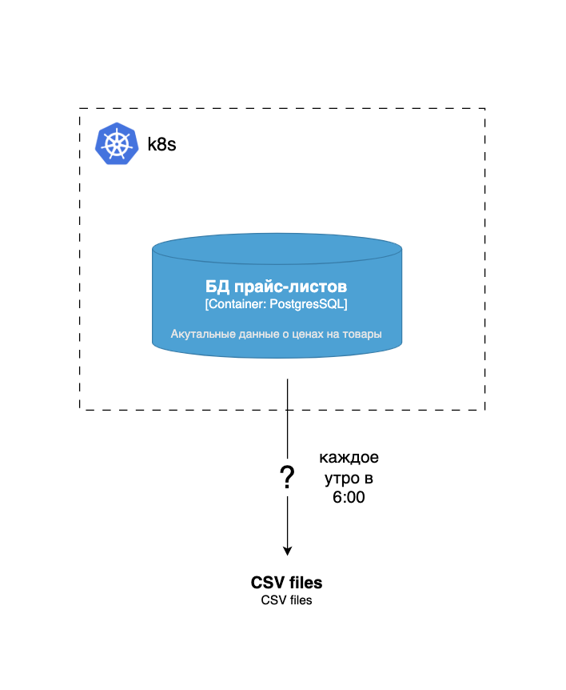

# Задание 2. Разработка дизайна модуля пакетной обработки данных

Каждое утро ровно в шесть онлайн-магазину нужно сгенерировать кастомные CSV/XLS-прайс-листы для B2B-клиентов на основе
текущих данных в БД. Процесс выгрузки не требует дополнительной логики по обработке данных.

Данные в PostgreSQL представлены в таблицах:

- `products` ~ 5 000–10 000 строк;
- `categories` ~ 50–200 строк;
- `clients` ~ 100–500 строк;
- `client_prices` ~ 10 000–20 000 строк.

Необходимо связать данные из таблиц и выгрузить их в CSV-файл. Объём данных 5 000–10 000 строк. Инфраструктура
магазина — микросервисы в облаке.

Диаграмма As Is состояния системы:

## Что нужно сделать

1. Обоснуйте выбор технологического решения. Вы можете воспользоваться шаблоном, на основе которого раскрыть собственные
   мысли, почему вы остановились именно на таком решении.

### Шаблон сравнения

|                                                                                       | Spring Batch | Apache Airflow | K8s Job | Spark |
|---------------------------------------------------------------------------------------|--------------|----------------|---------|-------|
| Наличие конфигурации CRON-расписания                                                  |              |                |         |       |
| Сложность реализации логики по обработке данных                                       |              |                |         |       |
| Ресурсоёмкость решения (количество потребляемых ресурсов)                             |              |                |         |       |
| Масштабируемость решения под нагрузкой и сложность реализации                         |              |                |         |       |
| Сложность развёртывания в облаке и интеграция с имеющейся микросервисной архитектурой |              |                |         |       |
| Удобство интеграции с системами логирования и мониторинга                             |              |                |         |       |

2. Составьте диаграмму контекста C4-архитектуры системы To Be. Опишите, как будет работать решение.
3. Подготовить верхнеуровневый пошаговый план конфигурации и его имплементации, который выполняют требуемый функционал.

В результате у вас должен получиться файл с заполненной таблицей и выводами, обосновывающими выбор решения, С4-диаграмма
To Be, а также документ с наброском верхнеуровневого плана по имплементации и конфигурации решения.

Загрузите всё в директорию Task2 вашего репозитория.