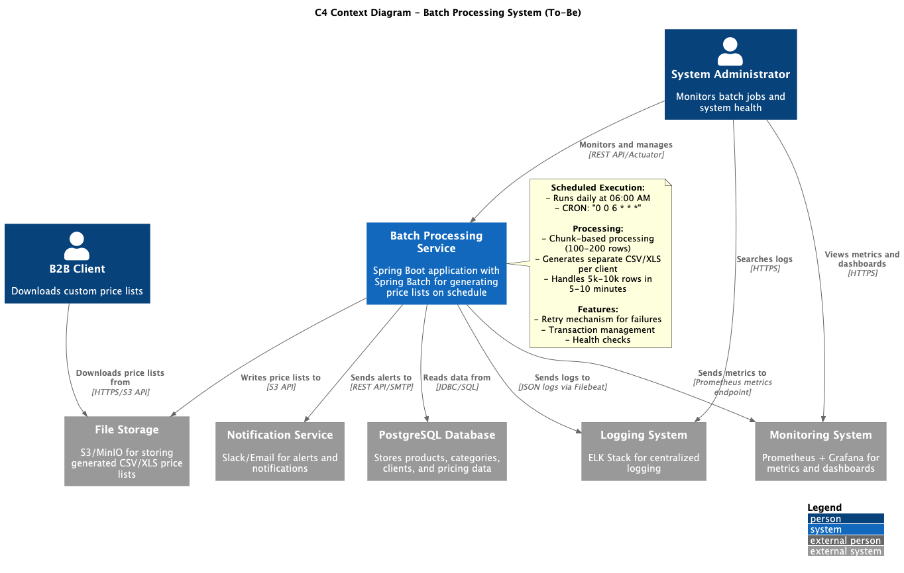
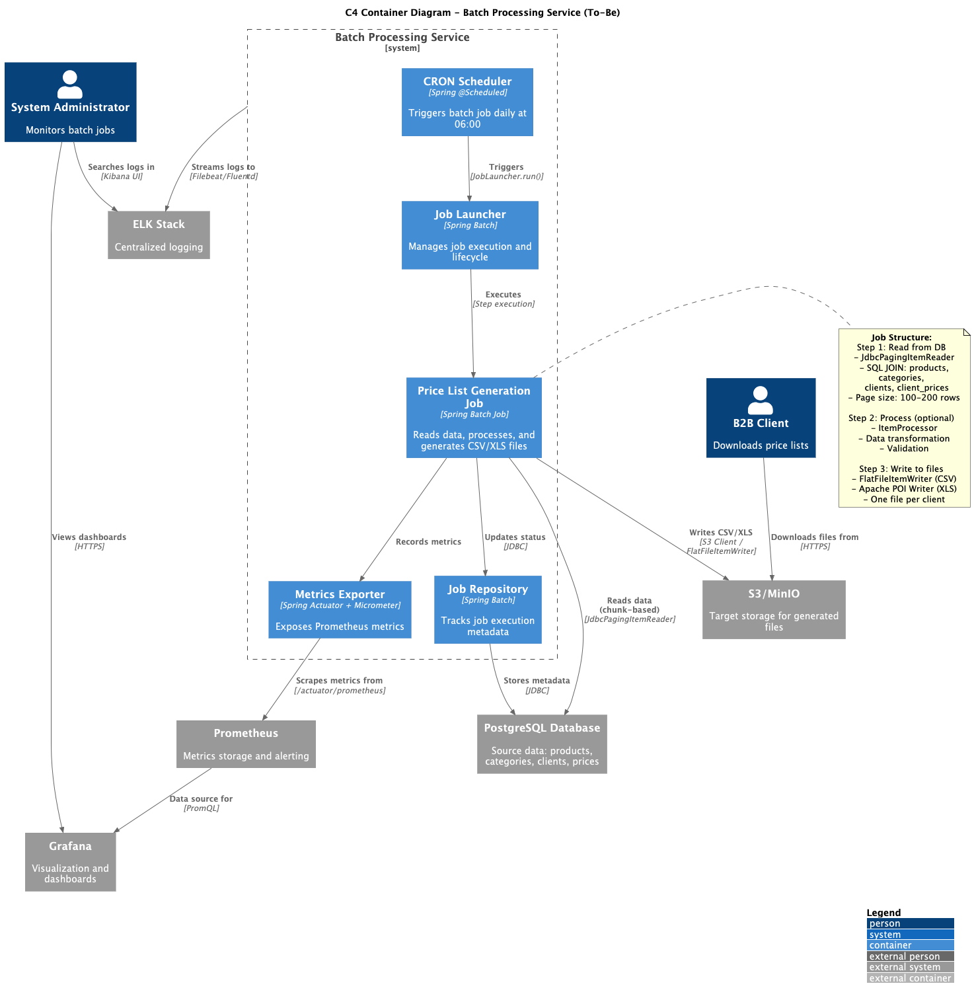

# Задание 2. Разработка дизайна модуля пакетной обработки данных

## 1. Сравнительный анализ технологических решений

### Таблица сравнения

|                                                                                       | Spring Batch                            | Apache Airflow                                       | K8s Job                               | Spark                                   |
|---------------------------------------------------------------------------------------|-----------------------------------------|------------------------------------------------------|---------------------------------------|-----------------------------------------|
| Наличие конфигурации CRON-расписания                                                  | Да (Spring Scheduler/Quartz)            | Да (встроенный планировщик)                          | Да (CronJob)                          | Нет (требуется внешний планировщик)     |
| Сложность реализации логики по обработке данных                                       | Низкая (встроенные readers/writers)     | Средняя (требуется написание Python/SQL кода)        | Средняя (требуется полная реализация) | Высокая (требуется знание Spark API)    |
| Ресурсоёмкость решения (количество потребляемых ресурсов)                             | Низкая (200-500 MB RAM)                 | Средняя (Airflow + Worker + Scheduler: 1-2 GB)       | Низкая (контейнер по требованию)      | Высокая (кластер Spark: 2-4 GB минимум) |
| Масштабируемость решения под нагрузкой и сложность реализации                         | Средняя (partitioning, threading)       | Высокая (горизонтальное масштабирование workers)     | Средняя (параллельные Jobs)           | Высокая (распределённая обработка)      |
| Сложность развёртывания в облаке и интеграция с имеющейся микросервисной архитектурой | Низкая (стандартный Spring Boot сервис) | Средняя (требуется развёртывание отдельного сервиса) | Низкая (нативная интеграция с K8s)    | Высокая (требуется Spark кластер)       |
| Удобство интеграции с системами логирования и мониторинга                             | Высокое (Spring Actuator, Micrometer)   | Высокое (встроенный UI, логирование)                 | Среднее (стандартные логи K8s)        | Среднее (Spark UI, требуется настройка) |

### Обоснование выбора технологического решения

**Рекомендуемое решение: Spring Batch**

#### Аргументы в пользу Spring Batch:

1. **Простота задачи**: Задача представляет собой простую ETL-операцию без сложных трансформаций - нужно только
   прочитать данные из PostgreSQL, объединить таблицы и выгрузить в CSV. Spring Batch предоставляет готовые компоненты
   для этого (JdbcPagingItemReader, FlatFileItemWriter).

2. **Объём данных**: 5 000-10 000 строк - это небольшой объём данных, который не требует распределённой обработки.
   Spring Batch справится с этим объёмом в течение нескольких минут.

3. **Ресурсоэффективность**: Spring Batch потребляет минимум ресурсов (200-500 MB RAM), что критично для облачной
   инфраструктуры, где каждый мегабайт стоит денег.

4. **Интеграция с существующей архитектурой**: Если микросервисы написаны на Java/Spring (что вероятно для
   enterprise-решений), Spring Batch идеально интегрируется в существующую экосистему без необходимости изучения новых
   технологий.

5. **Скорость внедрения**: Настройка Spring Batch для данной задачи занимает 1-2 дня работы, в то время как
   развёртывание Airflow или Spark кластера - минимум неделю.

6. **Мониторинг и отказоустойчивость**: Spring Batch предоставляет встроенные механизмы для отслеживания статуса job'ов,
   retry-логику, транзакционность и интеграцию с Spring Actuator для мониторинга.

#### Почему не другие решения:

- **Apache Airflow**: Избыточен для простой задачи. Требует развёртывания отдельного сервиса (scheduler, worker, web
  server, база метаданных), что увеличивает операционные расходы. Подходит для сложных DAG'ов с множеством зависимостей
  между задачами.

- **K8s CronJob**: Хороший вариант, но требует написания всей логики с нуля. Нет готовых компонентов для чтения из БД с
  пагинацией, обработки ошибок, retry-механизмов. Подходит для простых скриптов, но не для полноценной batch-обработки.

- **Apache Spark**: Полностью избыточен для 5-10k строк. Spark создан для обработки терабайтов данных. Требует
  развёртывания кластера, что неоправданно дорого для данной задачи. Добавляет сложность в разработку и поддержку.

#### Вывод:

Для задачи генерации прайс-листов с объёмом данных 5-10k строк оптимальным решением является **Spring Batch** благодаря
минимальной сложности реализации, низкой ресурсоёмкости и быстрой интеграции с существующей микросервисной архитектурой.

## 2. C4-диаграмма архитектуры системы To-Be

### Описание решения

Система будет состоять из следующих компонентов:

1. **Batch Processing Service** - микросервис на Spring Boot с интегрированным Spring Batch, который запускается по
   расписанию (cron) каждое утро в 6:00.

2. **PostgreSQL Database** - база данных с таблицами products, categories, clients, client_prices.

3. **File Storage** - хранилище для сгенерированных CSV/XLS файлов (например, S3, MinIO, или NFS).

4. **Monitoring & Logging** - системы мониторинга (Prometheus, Grafana) и логирования (ELK).

Процесс работы:

1. В 6:00 утра срабатывает CRON-триггер в Spring Scheduler
2. Запускается Spring Batch Job
3. Job читает данные из PostgreSQL порциями (chunk-based processing)
4. Для каждого B2B-клиента генерируется отдельный CSV-файл с кастомными ценами
5. Файлы сохраняются в File Storage
6. Метрики и логи отправляются в системы мониторинга
7. При успехе/ошибке отправляются уведомления

Диаграммы доступны в файлах:


контекстная диаграмма


контейнерная диаграмма

## 3. Верхнеуровневый план имплементации и конфигурации

### Этап 1: Подготовка инфраструктуры (1-2 дня)

1. **Создание нового микросервиса**
    - Инициализация Spring Boot проекта с зависимостями: Spring Batch, Spring Data JPA, PostgreSQL driver
    - Настройка Dockerfile и Kubernetes Deployment манифестов
    - Конфигурация подключения к PostgreSQL через ConfigMap/Secrets

2. **Настройка хранилища файлов**
    - Развёртывание S3-совместимого хранилища (MinIO) в K8s или использование облачного S3
    - Создание bucket для прайс-листов
    - Настройка credentials для доступа из batch-сервиса

### Этап 2: Разработка batch-процессинга (2-3 дня)

1. **Конфигурация Spring Batch Job**
   ```
   - Создание Job с именем "generatePriceListsJob"
   - Настройка JobRepository (использование существующей БД или отдельной схемы)
   - Конфигурация chunk size (рекомендуется 100-200 строк на chunk)
   ```

2. **Реализация ItemReader**
   ```
   - Создание JdbcPagingItemReader для чтения данных из PostgreSQL
   - SQL-запрос с JOIN таблиц products, categories, clients, client_prices
   - Настройка пагинации для обработки больших объёмов данных
   ```

3. **Реализация ItemProcessor (опционально)**
   ```
   - Если требуется дополнительная обработка данных (форматирование, валидация)
   - Группировка данных по клиентам для генерации отдельных файлов
   ```

4. **Реализация ItemWriter**
   ```
   - Создание FlatFileItemWriter для генерации CSV
   - Для XLS использовать библиотеку Apache POI
   - Реализация логики сохранения файлов в S3/MinIO
   - Настройка naming convention: client_{id}_{date}.csv
   ```

5. **Настройка транзакционности и обработки ошибок**
   ```
   - Конфигурация retry-механизма для сетевых ошибок
   - Настройка skip-политики для некорректных данных
   - Логирование ошибок и успешных операций
   ```

### Этап 3: Настройка планировщика (1 день)

1. **Конфигурация CRON-расписания**
   ```java
   @Scheduled(cron = "0 0 6 * * *") // Каждый день в 6:00
   public void runBatchJob() {
       jobLauncher.run(job, new JobParameters(...));
   }
   ```

2. **Альтернатива: использование K8s CronJob**
   ```yaml
   apiVersion: batch/v1
   kind: CronJob
   metadata:
     name: price-list-generator
   spec:
     schedule: "0 6 * * *"
     jobTemplate:
       spec:
         template:
           spec:
             containers:
             - name: batch-processor
               image: price-list-batch:latest
   ```

### Этап 4: Интеграция с мониторингом и логированием (1-2 дня)

1. **Настройка метрик для Prometheus**
   ```
   - Spring Boot Actuator endpoints (/actuator/prometheus)
   - Кастомные метрики: job_duration, processed_rows, failed_jobs
   - Настройка ServiceMonitor для Prometheus Operator
   ```

2. **Конфигурация логирования**
   ```
   - Структурированные логи в JSON формате
   - Отправка логов в ELK через Filebeat/Fluentd
   - Уровни логирования: INFO для успешных операций, ERROR для ошибок
   ```

3. **Настройка дашбордов в Grafana**
   ```
   - Дашборд с метриками: время выполнения job'а, количество обработанных строк
   - Графики по историческим данным
   - Настройка алертов при падении job'ов
   ```

4. **Алертинг через Alertmanager**
   ```
   - Уведомления в Slack/Email при ошибках выполнения
   - Алерты при превышении времени выполнения (SLA > 30 минут)
   ```

### Этап 5: Тестирование (2-3 дня)

1. **Unit-тесты**
   ```
   - Тестирование ItemReader, ItemProcessor, ItemWriter в изоляции
   - Использование тестовой БД (H2 или Testcontainers с PostgreSQL)
   ```

2. **Интеграционные тесты**
   ```
   - Тестирование полного Job'а end-to-end
   - Проверка корректности генерируемых CSV-файлов
   - Тестирование сценариев с ошибками (недоступность БД, отсутствие прав на запись)
   ```

3. **Нагрузочное тестирование**
   ```
   - Тестирование на максимальном объёме данных (10 000 строк)
   - Измерение времени выполнения и потребления ресурсов
   - Оптимизация chunk size при необходимости
   ```

### Этап 6: Развёртывание в Production (1 день)

1. **Подготовка окружения**
   ```
   - Создание namespace в K8s для batch-сервиса
   - Настройка RBAC и Service Account
   - Конфигурация Secrets для доступа к БД и S3
   ```

2. **Деплой сервиса**
   ```
   - Deploy через CI/CD pipeline (GitLab CI, Jenkins, ArgoCD)
   - Настройка resource limits (CPU: 500m-1, Memory: 512Mi-1Gi)
   - Конфигурация health checks и readiness probes
   ```

3. **Валидация**
   ```
   - Ручной запуск job'а для проверки работоспособности
   - Проверка сгенерированных файлов
   - Мониторинг метрик и логов
   ```

### Оценка времени и ресурсов

- **Общее время разработки**: 8-12 дней
- **Команда**: 1 Backend разработчик + 0.5 DevOps инженера
- **Инфраструктурные ресурсы**:
    - CPU: 500m-1 core
    - Memory: 512Mi-1Gi RAM
    - Storage: 10-50 GB для файлов (в зависимости от retention policy)

### Риски и митигация

| Риск                                 | Вероятность | Митигация                                                         |
|--------------------------------------|-------------|-------------------------------------------------------------------|
| Превышение времени выполнения job'а  | Средняя     | Оптимизация SQL-запросов, увеличение chunk size, профилирование   |
| Недоступность БД во время выполнения | Низкая      | Retry-механизм, мониторинг доступности БД                         |
| Нехватка места в хранилище           | Средняя     | Настройка retention policy, автоматическое удаление старых файлов |
| Ошибки при обработке данных          | Средняя     | Skip policy, валидация данных на уровне ItemProcessor             |

## Заключение

Предложенное решение на основе **Spring Batch** оптимально подходит для задачи генерации прайс-листов благодаря простоте
реализации, низкой ресурсоёмкости и быстрой интеграции с существующей микросервисной архитектурой. План имплементации
рассчитан на 8-12 рабочих дней и включает все необходимые этапы от разработки до развёртывания в production.
