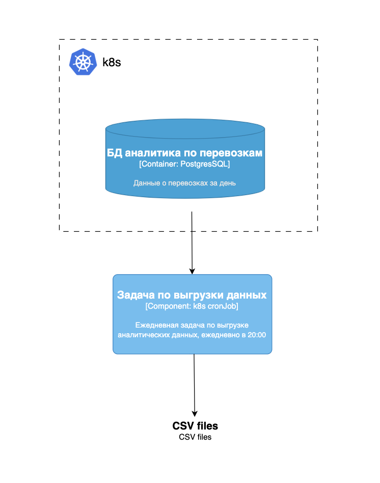

# Задание 3. Реализация Distributed Scheduling с k8s CronJob

Онлайн-платформа занимается грузоперевозками. Каждый день ровно в восемь вечера ей нужно выгружать данные в
специализированное хранилище для аналитиков. На основе выгруженных данных обновляются дашборды дневной отчётности. В
связи с текущим стеком и опытом разработчиков остановились на k8s CronJob.

Ежедневный объём данных включает следующие таблицы:

- `shipments` (перевозки) ~ 50 000–200 000 строк;
- `shipment_events` (события по перевозкам) ~ 500 000–1 000 000 строк;
- `drivers` (водители) ~ 1 000–5 000 строк;
- `vehicles` (транспорт) ~ 500–2 000 строк;
- `clients` (заказчики) ~ 10 000–50 000 строк.

Диаграмма To Be состояния системы:

## Что нужно сделать

Подготовьте yaml-файлы конфигурации, которые выполняют требуемый функционал. Достаточно реализовать метод простого
экспорта данных одной таблицы из БД на удобном вам языке программирования.

В результате у вас должны получиться конфигурационные файлы для создания Docker-образа, конфигурационные файлы k8s job,
чтобы использовать Docker-образа с cron-конфигурацией, а также видео или скриншоты, которые продемонстрируют работу k8s
job в MiniKube.

Загрузите всё в директорию Task3 вашего репозитория.
