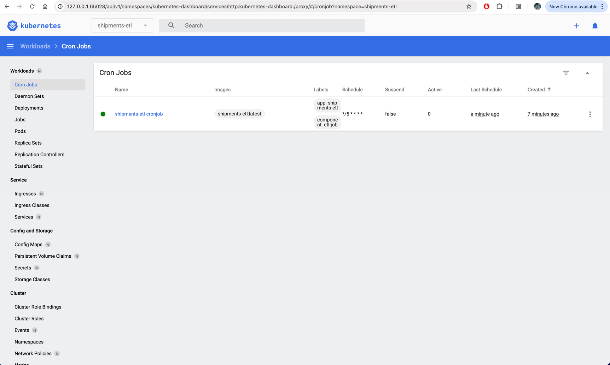
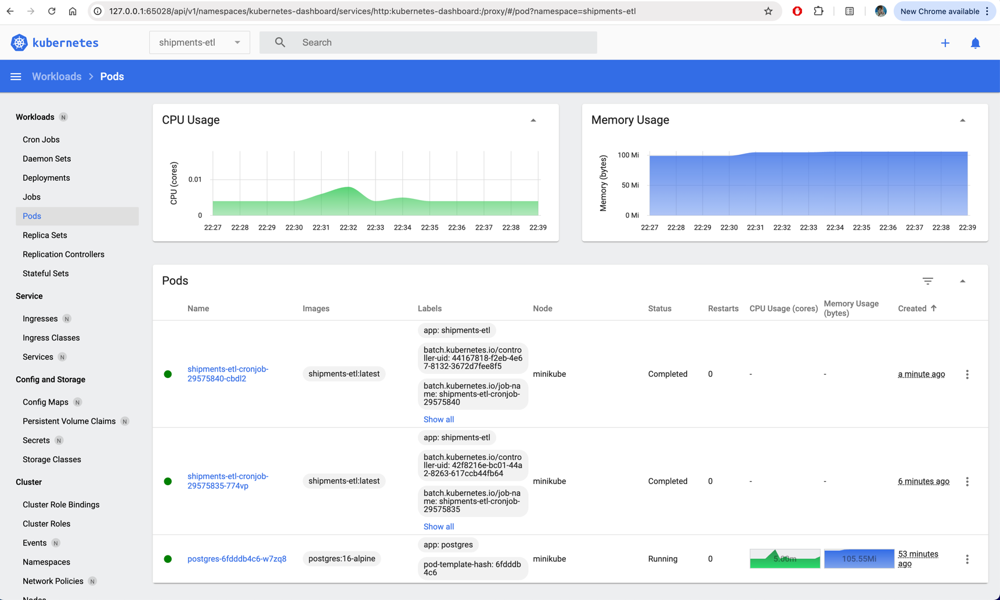
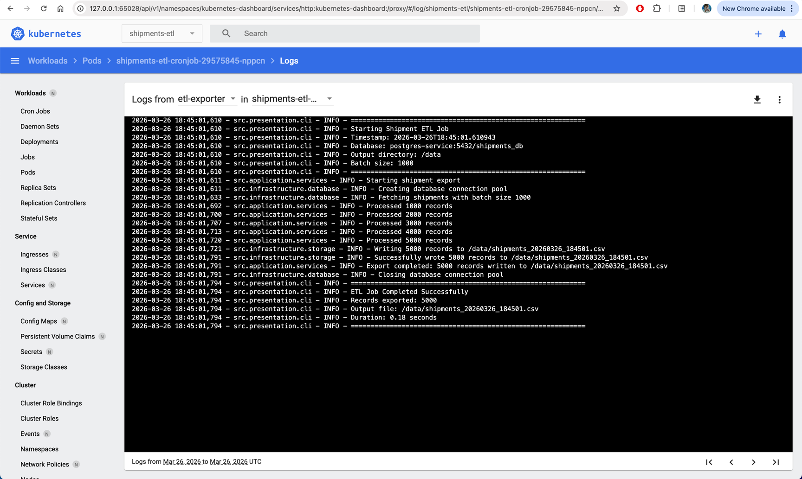
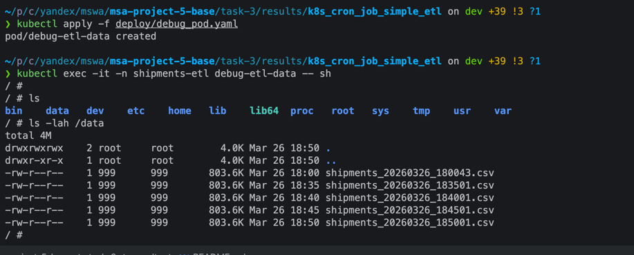
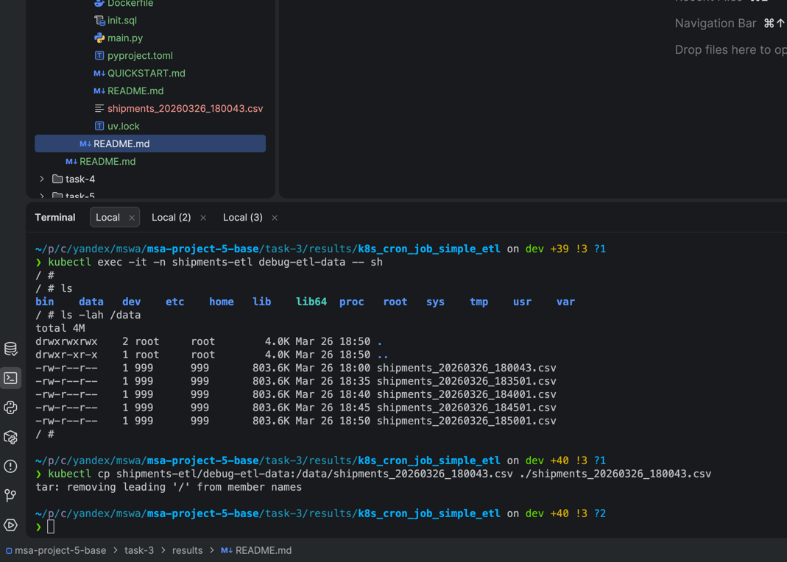
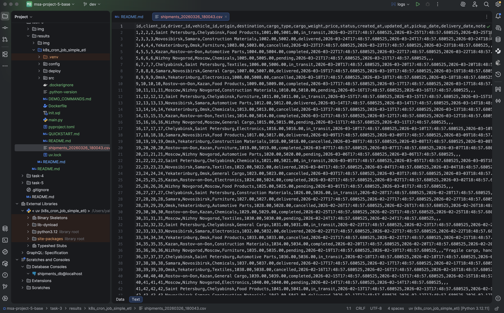
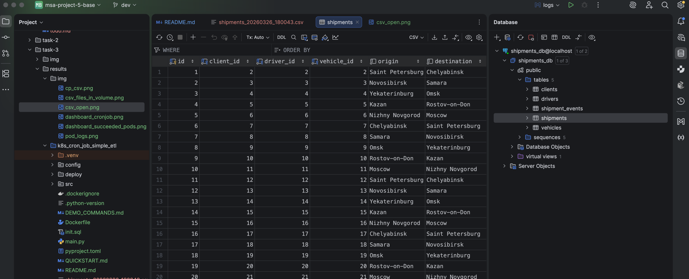

# Результаты

## Исходники

- [приложуха](k8s_cron_job_simple_etl)
- [конфиги](k8s_cron_job_simple_etl/deploy)

## Proof of Work

1. После применения конфигов и того как крон-джоба пару раз отработала на дашборде видно:
    - Саму джобу 
    - Отработавшие поды 
2. Логи из подов 
3. Логи из kubectl

```text
❯ kubectl get pods -n shipments-etl                                                                          
NAME                                   READY   STATUS      RESTARTS   AGE
postgres-6fdddb4c6-w7zq8               1/1     Running     0          60m
shipments-etl-cronjob-29575835-774vp   0/1     Completed   0          14m
shipments-etl-cronjob-29575840-cbdl2   0/1     Completed   0          9m1s
shipments-etl-cronjob-29575845-nppcn   0/1     Completed   0          4m1s
```

3. Файл с выгрузкой я сохраняю в хранилище в кубе, при желании его можно найти и
   достать:
    - 
    - 
4. Файл корректно открывается 
    - Данные соответствуют тем, что весть в бд (из них и формируется выгрузка) 