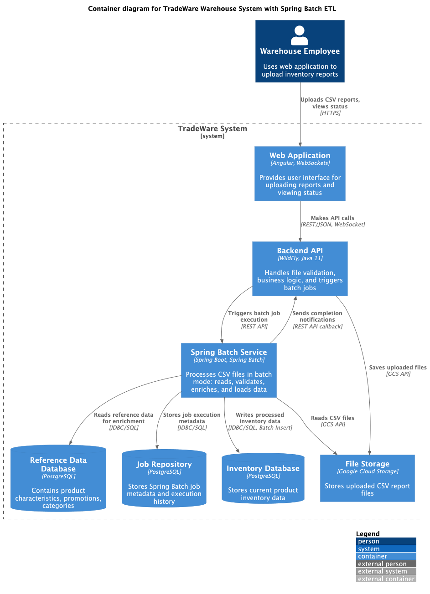
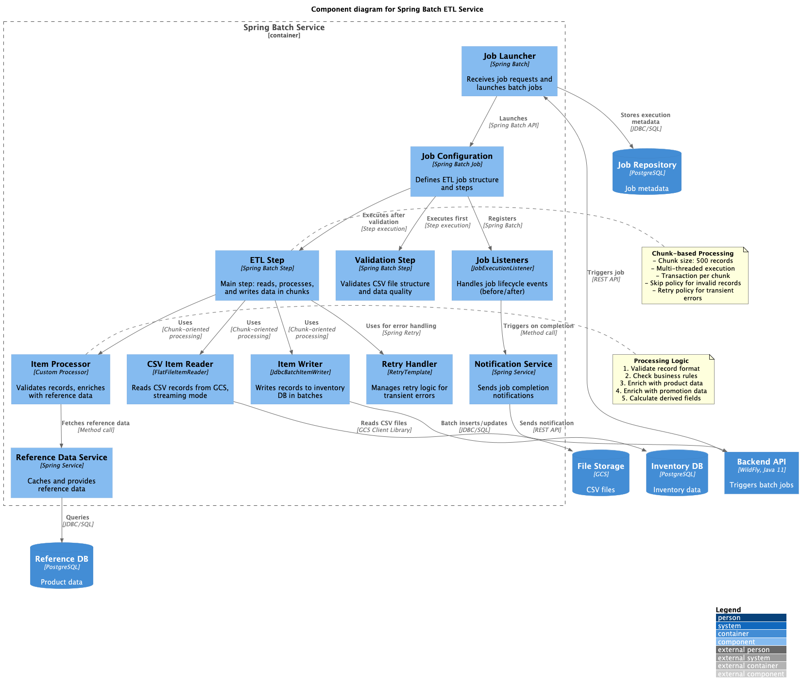

# Задание 4: Реализация ETL с использованием Spring Batch

## Описание

Данное задание содержит архитектурное решение для внедрения пакетной обработки данных в систему TradeWare с
использованием Spring Batch.

## Контекст

TradeWare — компания, предоставляющая складские решения для хранения стройматериалов. Система испытывает проблемы с
производительностью при обработке больших объемов данных (до 1.2М записей в сутки) в пиковые периоды. Требуется
внедрение batch-обработки для:

- Обработки 100-150 параллельных загрузок файлов в пиковые часы
- Достижения SLA: 30 секунд на обработку файла с 2000 строк
- Надежной работы с механизмами retry и restart

## Состав решения

### 1. ADR документ (`adr_spring_batch_etl.md`)

Архитектурное решение включает:

**Функциональные требования:**

- 8 основных Use Cases (загрузка файлов, валидация, обогащение данных, обработка ошибок, параллельная обработка)

**Нефункциональные требования:**

- Производительность: <30 сек на 2000 строк
- Масштабируемость: 100-150 параллельных загрузок
- Надежность: retry/restart механизмы
- Обработка до 1.2М строк в сутки

**Архитектурное решение:**

- **Spring Batch** как основная технология ETL
- **Chunk-ориентированная обработка** (chunk size: 500 записей)
- **Параллелизация:** multi-threading, partitioning, remote chunking
- **Отказоустойчивость:** skip policy, retry policy, restart capability
- **Интеграция:** REST API с WildFly, GCS для файлов, PostgreSQL для данных

**Альтернативы:**

- Apache Airflow
- AWS Glue / Google Cloud Dataflow
- Custom Python ETL (Pandas)
- Apache NiFi
- Quartz Scheduler + Custom Code

Подробное сравнение и обоснование выбора Spring Batch.

**Риски и митигации:**

- Риск неправильного chunk size → нагрузочное тестирование
- Риск deadlock → правильная настройка транзакций
- Риск OOM → streaming, chunk processing
- Недостаток опыта → обучение команды

### 2. C4 диаграммы

#### `c4_spring_batch_architecture.puml` - Container Diagram



Диаграмма контейнеров показывает:

- **Web Application** (Angular) — интерфейс пользователя
- **Backend API** (WildFly) — валидация и триггер batch jobs
- **Spring Batch Service** — основной компонент пакетной обработки
- **Databases:** Inventory DB, Reference DB, Job Repository
- **File Storage** (GCS) — хранилище CSV файлов

Потоки данных:

```
User → Web App → Backend API → Spring Batch Service
                                ↓
                    GCS ← Read CSV
                    Reference DB ← Enrich data
                    Inventory DB ← Write results
                    Job Repository ← Job metadata
```

#### `c4_spring_batch_components.puml` - Component Diagram



Детализация Spring Batch Service:

- **Job Launcher** — запуск batch jobs через REST API
- **Job Configuration** — определение структуры job и steps
- **Validation Step** — валидация CSV перед обработкой
- **ETL Step** — основной шаг обработки (chunk-oriented)
- **CSV Item Reader** — чтение из GCS
- **Item Processor** — валидация и обогащение данных
- **Item Writer** — batch-запись в PostgreSQL
- **Reference Service** — кеширование справочных данных
- **Notification Service** — уведомления о завершении
- **Retry Handler** — обработка транзиентных ошибок

## Ключевые решения

1. **Spring Batch выбран потому что:**
    - Нативная интеграция с Java/Spring ecosystem
    - Зрелое enterprise-решение с 15+ летней историей
    - Встроенные batch-паттерны (chunk processing, retry, restart)
    - Легкая интеграция с существующим WildFly backend
    - Готовность к микросервисной архитектуре

2. **Chunk size = 500 записей:**
    - Баланс между производительностью и стабильностью
    - Для 2000 строк = 4 транзакции
    - При ошибке откатывается только 500 записей

3. **Параллелизация на нескольких уровнях:**
    - Multi-threaded steps для обработки одного файла
    - Partitioning для разделения большого файла
    - Горизонтальное масштабирование instances для 150 параллельных загрузок

4. **Отказоустойчивость:**
    - Skip невалидных записей с логированием
    - Retry транзиентных ошибок (3 попытки)
    - Restart с точки остановки через JobRepository

## Стратегия внедрения

- **Фаза 1** (2-3 недели): Proof of Concept
- **Фаза 2** (1 месяц): MVP с базовым мониторингом
- **Фаза 3** (1-2 месяца): Production Ready с масштабированием
- **Фаза 4** (ongoing): Оптимизация на основе реальных метрик

## Связанные документы

- [Задание 5: Мониторинг и логирование](../../task-5/README.md)
- [Case diagram текущей архитектуры](../../content/diagrams/case_diagram_1.drawio)

