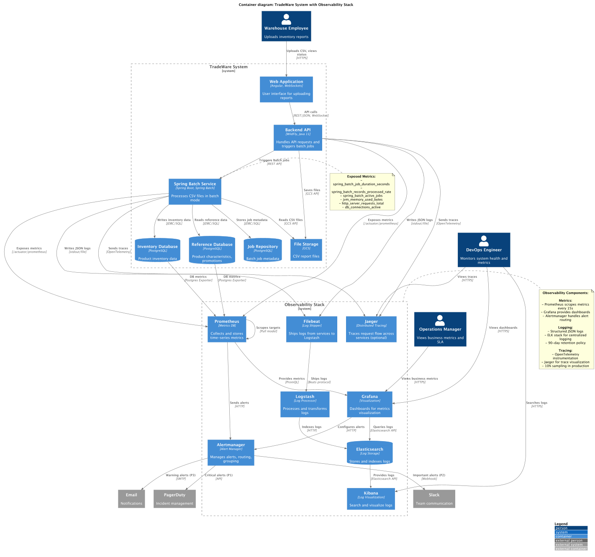
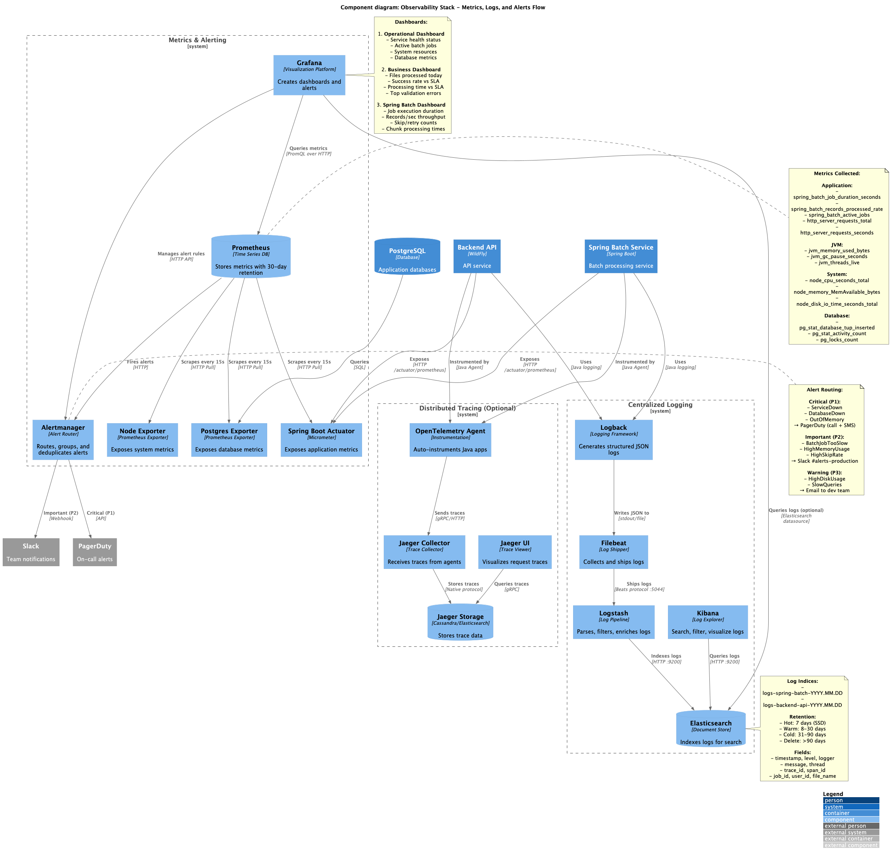

# Задание 5: Проектирование и реализация решений для мониторинга, оповещения и логирования

## Описание

Данное задание содержит архитектурное решение для внедрения централизованной системы мониторинга, логирования и
оповещения (observability) в систему TradeWare.

## Контекст

TradeWare столкнулась с проблемой отсутствия observability:

- Нет централизованного мониторинга производительности
- Логи разрозненны (только в файлы)
- Отсутствуют проактивные оповещения о проблемах
- Невозможно провести root cause analysis при инцидентах
- Нет видимости бизнес-метрик

После внедрения Spring Batch (Задание 4) необходимо обеспечить:

- Мониторинг производительности batch jobs
- Сбор и анализ логов из всех компонентов
- Автоматические оповещения при проблемах
- Дашборды для DevOps и менеджмента

## Состав решения

### 1. Документ с обоснованием метрик (`monitoring_metrics_justification.md`)

Комплексный документ, описывающий:

#### Выбранный стек технологий:

- **Prometheus** — сбор и хранение метрик (time-series DB)
- **Grafana** — визуализация метрик и дашборды
- **ELK Stack** (Elasticsearch, Logstash, Kibana) — централизованное логирование
- **Alertmanager** — управление алертами и маршрутизация
- **Micrometer** (Spring Boot Actuator) — инструментация приложений
- **OpenTelemetry + Jaeger** — distributed tracing (опционально)

#### Категории метрик:

**1. Метрики приложений:**

- Spring Batch Jobs:
    - `spring_batch_job_duration_seconds` — время выполнения job
    - `spring_batch_records_processed_rate` — скорость обработки записей
    - `spring_batch_active_jobs` — количество активных jobs (max 150)
    - `spring_batch_job_status_total` — success/failure rate
    - `spring_batch_item_skip_count` — невалидные записи
    - `spring_batch_retry_count` — количество retry

- Backend API:
    - `http_server_requests_total` — количество HTTP запросов
    - `http_server_requests_seconds` — latency API endpoints
    - `file_validation_errors_total` — ошибки валидации файлов

- Database:
    - `hikaricp_connections_active` — использование connection pool
    - `db_query_duration_seconds` — время выполнения запросов
    - `db_deadlocks_total` — deadlock при параллельной обработке

**2. Инфраструктурные метрики:**

- JVM:
    - `jvm_memory_used_bytes` — использование heap
    - `jvm_gc_pause_seconds` — GC паузы
    - `process_cpu_usage` — CPU процесса

- System (Node Exporter):
    - CPU, Memory, Disk I/O, Network traffic

**3. Бизнес-метрики:**

- `business_files_processed_total` — файлов обработано за период
- `business_processing_success_rate` — success rate (SLA >95%)
- `business_avg_processing_time_seconds` — среднее время обработки (SLA <30s)
- `business_records_processed_total` — записей обработано (цель 1.2М в день)

#### Логирование:

**Структурированные JSON логи с обязательными полями:**

```json
{
  "timestamp": "2026-03-28T10:15:30.123Z",
  "level": "INFO",
  "message": "Batch job completed",
  "trace_id": "a1b2c3d4e5f6",
  "job_id": "job-12345",
  "user_id": "employee-12345",
  "file_name": "report.csv"
}
```

**Уровни логирования:**

- **ERROR** — критичные ошибки → Alert в Alertmanager
- **WARN** — потенциальные проблемы → мониторинг трендов
- **INFO** — важные бизнес-события (аудит)
- **DEBUG/TRACE** — только для troubleshooting

**Log aggregation flow:**

```
Application → Logback (JSON) → Filebeat → Logstash → Elasticsearch → Kibana
```

**Retention policy:**

- Hot tier: 7 дней (SSD)
- Warm tier: 8-30 дней
- Cold tier: 31-90 дней
- Удаление: >90 дней

#### Алерты:

**Критические (P1 - PagerDuty):**

- ServiceDown, DatabaseDown, OutOfMemory, DiskSpaceCritical

**Важные (P2 - Slack):**

- BatchJobTooSlow, HighMemoryUsage, HighCPUUsage, HighSkipRate

**Предупреждающие (P3 - Email):**

- HighDiskUsage, SlowQueries, HighRetryRate

**Пример alert rule:**

```yaml
- alert: BatchJobTooSlow
  expr: histogram_quantile(0.95, spring_batch_job_duration_seconds) > 30
  for: 5m
  annotations:
    summary: "95th percentile job duration > 30s (SLA violation)"
```

#### Дашборды Grafana:

1. **Operational Dashboard** (DevOps):
    - Service health status
    - Active batch jobs, job queue size
    - System resources (CPU, Memory, Disk)
    - Database connection pool

2. **Business Dashboard** (Менеджмент):
    - Файлов обработано сегодня
    - Success rate vs SLA (>95%)
    - Avg processing time vs SLA (<30s)
    - Top 5 validation errors

3. **Spring Batch Detailed Dashboard**:
    - Job execution duration histogram
    - Records/sec throughput
    - Skip/retry counts
    - Chunk processing time distribution

#### Distributed Tracing (опционально):

OpenTelemetry + Jaeger для:

- Визуализации пути запроса через сервисы
- Latency breakdown (где происходит задержка)
- Корреляция логов по `trace_id`

Пример trace:

```
User → Web App → Backend API → Spring Batch → PostgreSQL
         50ms        80ms        28000ms       23000ms (bottleneck!)
```

### 2. C4 диаграммы с observability компонентами

#### `c4_full_architecture_with_observability.puml` - Container Diagram



Полная архитектура системы с добавленными компонентами:

**Observability Stack:**

- **Prometheus** — scraping метрик из приложений
- **Grafana** — визуализация метрик, дашборды
- **Alertmanager** — маршрутизация алертов
- **Elasticsearch** — хранение логов
- **Logstash** — обработка логов
- **Kibana** — поиск и визуализация логов
- **Filebeat** — shipping логов из сервисов
- **Jaeger** — distributed tracing (опционально)

**Внешние интеграции:**

- PagerDuty — критичные алерты (P1)
- Slack — важные алерты (P2)
- Email — предупреждения (P3)

**Потоки данных:**

```
Metrics:  App → Prometheus → Grafana
                     ↓
                Alertmanager → PagerDuty/Slack/Email

Logs:     App → Filebeat → Logstash → Elasticsearch → Kibana
                                                     ↓
                                                  Grafana (optional)

Traces:   App → OpenTelemetry Agent → Jaeger
```

#### `c4_observability_detailed.puml` - Component Diagram



Детализация Observability Stack:

**Metrics & Alerting:**

- Spring Boot Actuator → `/actuator/prometheus` endpoint
- Node Exporter → system metrics
- Postgres Exporter → database metrics
- Prometheus → pull каждые 15s
- Grafana → queries через PromQL
- Alertmanager → routing rules по severity

**Centralized Logging:**

- Logback → structured JSON logs
- Filebeat → log shipper
- Logstash → parsing, filtering, enrichment
- Elasticsearch → indexing (`logs-spring-batch-*`, `logs-backend-api-*`)
- Kibana → search UI

**Distributed Tracing:**

- OpenTelemetry Java Agent → auto-instrumentation
- Jaeger Collector → receive traces
- Jaeger Storage → Cassandra/Elasticsearch
- Jaeger UI → trace visualization

## Ключевые решения

1. **Почему Prometheus + Grafana:**
    - Де-факто стандарт для микросервисов
    - Pull-based модель → просто масштабируется
    - PromQL — мощный язык запросов
    - Интеграция с Spring Boot Actuator

2. **Почему ELK Stack:**
    - Масштабируемое хранилище для логов
    - Full-text search
    - Структурированные JSON логи
    - Retention policies для оптимизации хранения

3. **Структурированные логи (JSON):**
    - Легко парсятся в ELK
    - Поддержка trace_id для корреляции
    - Контекстные поля (job_id, user_id, file_name)

4. **3-уровневая система алертов:**
    - P1 (Critical) → PagerDuty (call + SMS) — immediate action
    - P2 (Important) → Slack — action within 1 hour
    - P3 (Warning) → Email — investigate when possible

5. **Distributed Tracing (опционально):**
    - Понимание latency breakdown
    - Отладка сложных распределенных сценариев
    - Корреляция логов через trace_id

## Ожидаемые результаты

### Количественные:

- **MTTD** (Mean Time To Detect): с ~30 минут → <2 минут
- **MTTR** (Mean Time To Resolve): с ~2 часов → <30 минут
- **Visibility**: 100% покрытие метриками и логами
- **Alerting**: <5% false positive rate

### Качественные:

- Проактивное обнаружение проблем до жалоб пользователей
- Быстрый root cause analysis
- Capacity planning на основе метрик
- Улучшение SLA и UX

## Стратегия внедрения

- **Фаза 1** (1-2 недели): Foundation — Prometheus, Grafana, ELK
- **Фаза 2** (2-3 недели): Application Instrumentation — метрики, логи
- **Фаза 3** (1 неделя): Alerting — Alertmanager, alert rules
- **Фаза 4** (2-3 недели): Advanced — трассировка, детальные дашборды
- **Фаза 5** (ongoing): Optimization — тюнинг thresholds

## Связанные документы

- [Задание 4: Spring Batch ETL](../../task-4/results/)
- [Case diagram текущей архитектуры](../../content/diagrams/case_diagram_1.drawio)
